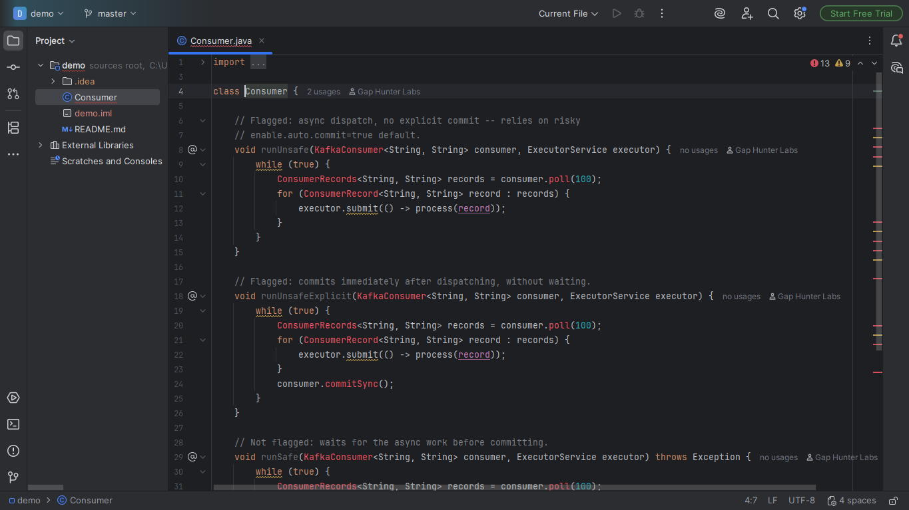
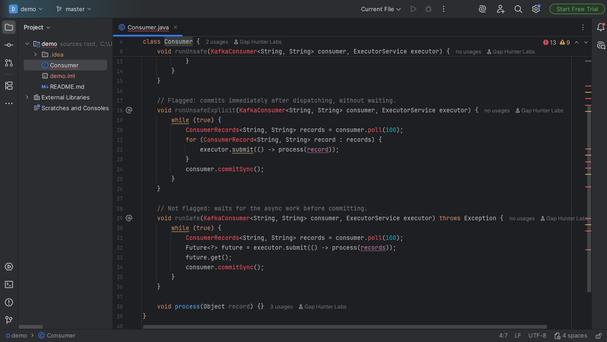
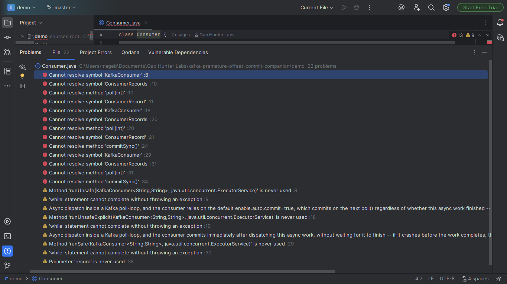

# Kafka Premature Offset Commit Companion

Warning on a Kafka consumer poll-loop (`while (true) { ... poll(...) ... }`)
that dispatches asynchronous work (`ExecutorService.submit(...)`,
`CompletableFuture.runAsync(...)`/`.supplyAsync(...)`) without waiting
for it to finish BEFORE the consumer commits offsets -- either
explicitly (`commitSync()`/`commitAsync()` called right there) or
implicitly (no manual commit at all, relying on Kafka's own default
`enable.auto.commit=true`, which commits on the next `poll()` cycle
regardless of whether the dispatched work finished).

## Screenshots







## Why it exists

If the consumer crashes between the commit and the real completion of
that work, the message is lost silently -- no error, no retry, nothing
visible. Extensively documented as a real, common Kafka consumer bug
(Medium, Conduktor, official offset-management guides); no Marketplace
plugin found dedicated to this.

## Why built this way

**Correlates three independent signals in the same loop body** -- none
alone is enough:

- Async dispatch alone is fine if the loop waits for it
  (`.get()`/`.join()`/`.awaitTermination()`).
- A commit call alone is fine if nothing async was dispatched.
- No explicit commit at all only matters because it means the risky
  auto-commit default is in play.

## v0.1 scope — stated honestly, not exhaustively

Only the official `org.apache.kafka:kafka-clients` client with the
standard poll-loop shape -- never covers Kafka Streams or wrapped
messaging frameworks (Spring Kafka's `@KafkaListener` is out of scope,
a future extension).

## Usage

Open any Java file with a Kafka consumer poll-loop. Async dispatch
inside the loop with no synchronous wait before the commit (explicit
or default) shows a warning.

## Support

- **Bugs and feature requests:** [GitHub Issues](https://github.com/GapHunterLabs/kafka-premature-offset-commit-companion/issues)
- **Questions, or custom rules for a team's codebase:** **gaphunterlabs@gmail.com**
- **Security vulnerabilities:** report privately as described in [SECURITY.md](SECURITY.md), not in a public issue.
- **Privacy and network behavior:** [PRIVACY.md](PRIVACY.md)

## Development

```
./gradlew test           # unit tests
./gradlew buildPlugin    # generates build/distributions/*.zip
./gradlew verifyPlugin   # checks compatibility against real IDEs
```

## License

Apache-2.0. See `LICENSE`.
